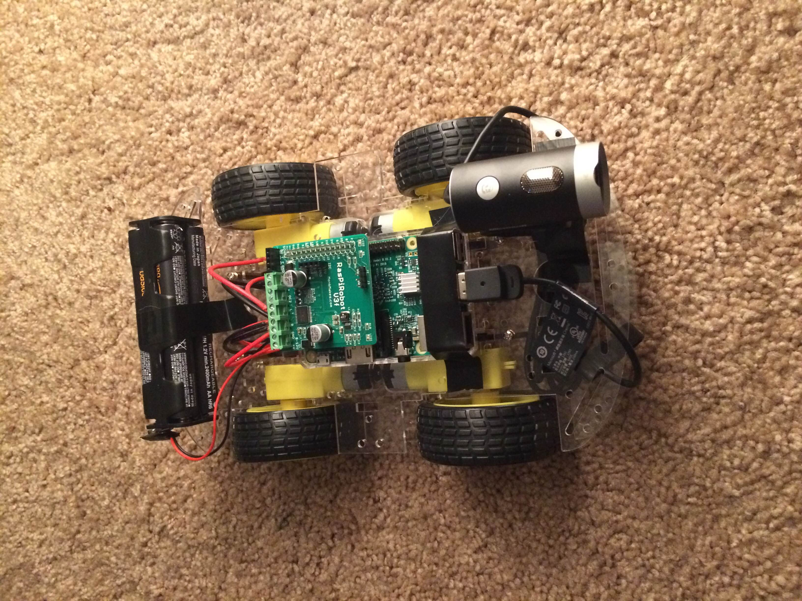
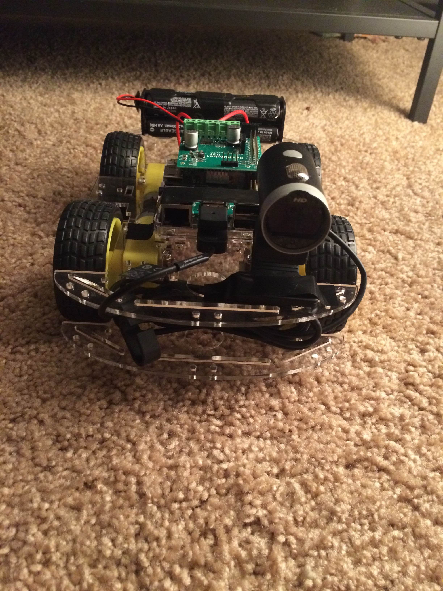
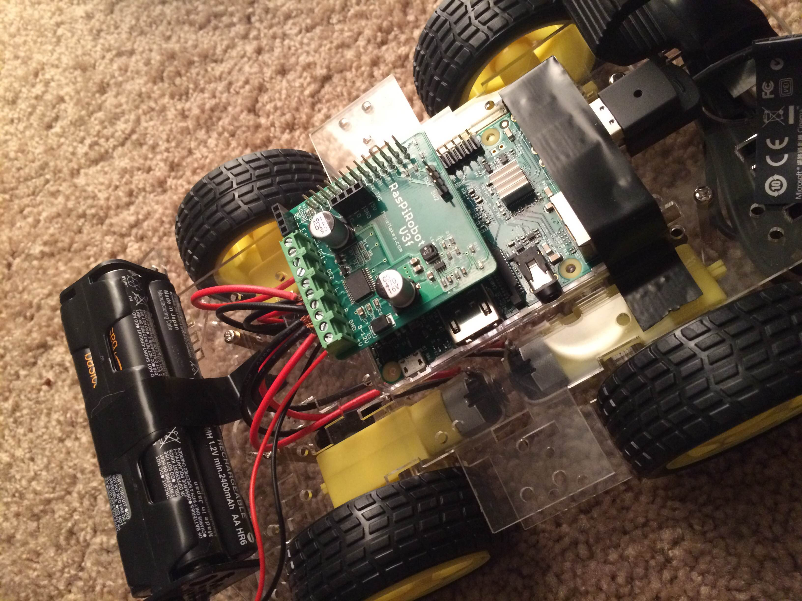

# RasberryPi Self Driving Car
A simple rasberry pi self driving car using preact, node, python & opencv

## Stack
 * Node websocket server
 * React client to show video and audio stream
 * Use mobile phone's gyro to control the car
 * Detect lanes with opencv.
 * Switch between manual and auto-mode

## Build Shots

